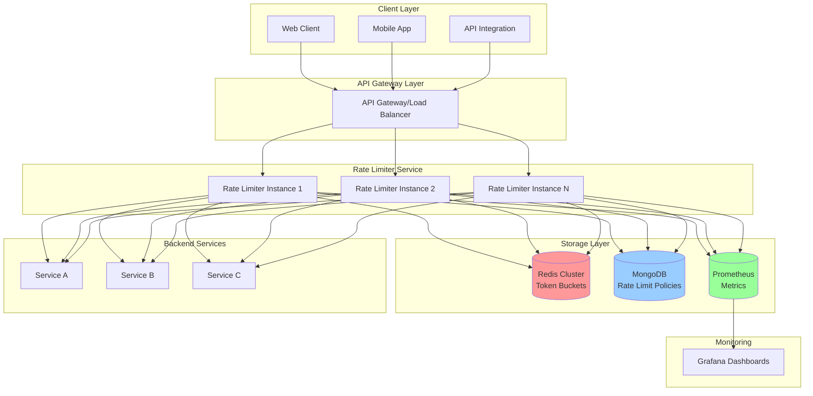
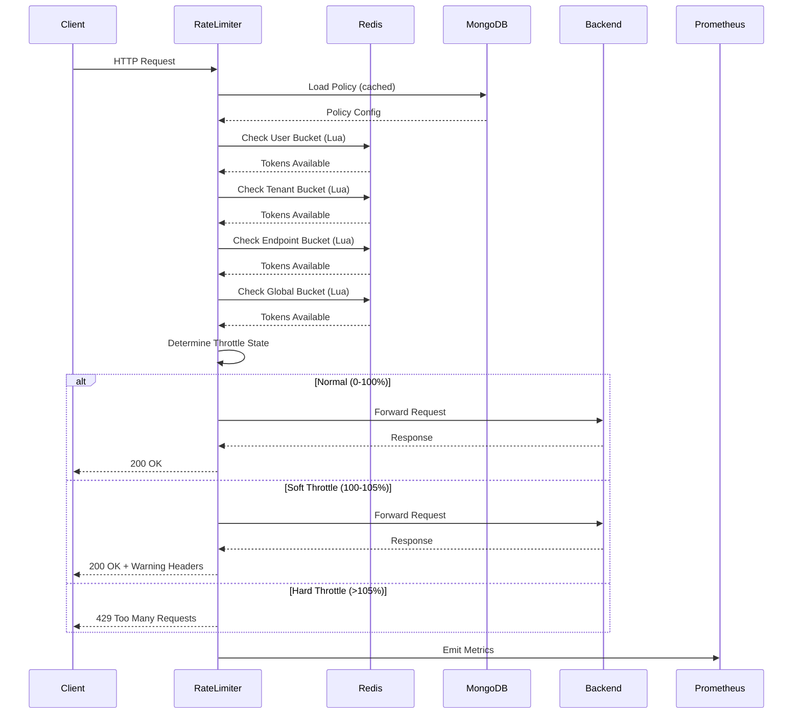
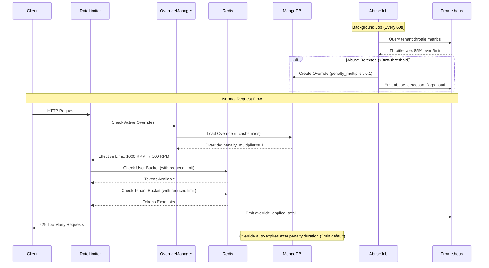

# Multi-Tenant Rate Limiting System - Architecture Overview

## Table of Contents
- [Summary](#summary)
- [System Goals](#system-goals)
- [High-Level Architecture](#high-level-architecture)
- [Core Components](#core-components)
- [Technology Stack](#technology-stack)
- [Key Design Decisions](#key-design-decisions)

---

## Summary

This document outlines the architecture for a scalable, multi-tenant rate limiting system designed to support **10,000+ tenants** with diverse rate limiting requirements. The system provides:

- **Hierarchical rate limiting** at 4 scopes: User → Tenant → API Endpoint → Global System
- **Burstable limits** using Token Bucket algorithm with configurable burst capacity
- **Progressive throttling** Default hard enforcement with configurable soft enforcement for non critical endpoints
- **Abuse Detection** Detects tenant level abuse accordingly penalize or temporarily ban tenant. 
- **High availability** with fail-open strategy during Redis outages
- **Exact consistency** within a single region, with future multi-region support via eventual consistency
- **Real-time metrics** and observability via Prometheus & Grafana

---

## System Goals

### Functional Requirements

| Requirement | Description | Priority |
|-------------|-------------|----------|
| **FR-1** | Support 10,000+ tenants with individual rate limit policies | P0 |
| **FR-2** | Hierarchical limits: User, Tenant, API Endpoint, Global System | P0 |
| **FR-3** | Burstable token bucket with configurable burst capacity | P0 |
| **FR-4** | Progressive throttling (Normal → Soft → Hard) | P0 |
| **FR-5** | Policy hot-reload from MongoDB with caching | P1 |
| **FR-6** | Anonymous request limiting by IP address | P1 |
| **FR-7** | Abuse detection by tenant level high throttling | P2 |
| **FR-8** | Extensible to multi-region (future) | P3 |

### Non-Functional Requirements

| Requirement | Target | Measurement |
|-------------|--------|-------------|
| **NFR-1: Latency** | <5ms P99 overhead | Rate limiter adds <5ms to request latency |
| **NFR-2: Throughput** | 100,000 RPM global system capacity | Support 100k requests/minute across all tenants |
| **NFR-3: Availability** | 99.9% uptime | System remains available during Redis outages (fail-open) |
| **NFR-4: Consistency** | Exact within region | Token counts are atomically consistent within same region |
| **NFR-5: Scalability** | Linear horizontal scaling | Add Redis shards and rate limiter instances without code changes |

---

## High-Level Architecture



---

## Core Components

### 1. Rate Limiter Service (Node.js/TypeScript)

**Responsibilities:**
- Intercept incoming requests before they reach backend services
- Extract identity metadata (tenant_id, user_id, endpoint, IP)
- Check rate limits across all 4 scopes hierarchically
- Apply progressive throttling (normal → soft → hard)
- Emit metrics to Prometheus
- Serve as SDK/middleware for backend services

**Key Modules:**
- **Policy Manager**: Load and cache policies from MongoDB
- **Token Bucket Engine**: Execute token bucket algorithm with Redis
- **Throttle Decisioner**: Determine normal/soft/hard throttling state
- **Metrics Emitter**: Push counters to Prometheus
- **Fallback Handler**: Implement fail-open strategy during Redis outage

---

### 2. Abuse Detection Service

**Responsibilities:**
- Monitor tenant throttle rates across rolling time windows
- Detect pathological traffic patterns (high throttle rate, traffic spikes)
- Automatically create temporary overrides to penalize abusive tenants
- Expire overrides after configured penalty duration
- Emit metrics for abuse detection events

**Key Modules:**
- **Abuse Detection Job**: Background job that periodically checks tenant metrics
- **Override Manager**: Manages override lifecycle and precedence rules
- **Penalty Calculator**: Computes adaptive penalties based on violation severity

**Detection Signals (v1):**
- High throttle rate: Tenant exceeds configured threshold (default: 80%) over rolling window (default: 5 minutes)
- Future: Sudden traffic spikes, multi-signal composite scoring

**Override Types:**
- **Penalty Multiplier**: Reduce effective rate limit by multiplier (e.g., 0.1 = 10% of normal)
- **Temporary Ban**: Block all requests until override expires
- **Custom Limit**: Set specific rate/burst overrides for tenant

**Override Precedence:**
- Overrides apply BEFORE standard policies
- Specificity hierarchy: User+Endpoint > User > Endpoint > Tenant
- All overrides are time-bounded (expiresAt required)

**Safety Controls:**
- Manual kill switch via `ABUSE_DETECTION_ENABLED=false`
- Conservative defaults (80% threshold, 5-minute window)
- Adaptive penalties scale with violation severity

---

### 3. Redis Cluster

**Purpose:** Store token bucket state for real-time rate limiting

**Data Structures:**
```
# User-level token bucket
ratelimit:tenant:{tenant_id}:user:{user_id}:bucket
  → Hash {tokens: float, last_refill_ms: int}

# Tenant-level token bucket
ratelimit:tenant:{tenant_id}:bucket
  → Hash {tokens: float, last_refill_ms: int}

# Endpoint-level token bucket
ratelimit:endpoint:{endpoint_name}:bucket
  → Hash {tokens: float, last_refill_ms: int}

# Global system token bucket
ratelimit:global:bucket
  → Hash {tokens: float, last_refill_ms: int}
```

**Consistency Model:**
- **Single Region**: Exact consistency using Lua scripts for atomic operations
- **Multi-Region (Future)**: Eventual consistency with regional allocation

**Sharding Strategy:**
- Shard by `tenant_id` for tenant and user buckets
- Dedicated shard for global/endpoint buckets (lower cardinality)

---

### 4. MongoDB

**Purpose:** Store rate limit policy configurations

**Collections:**

**`rate_limit_policies`**
```json
{
  "_id": "tenant_abc123",
  "tenant_id": "tenant_abc123",
  "tier": "pro",
  "policies": {
    "tenant": {
      "rpm": 5000,
      "rps": 100,
      "burst_capacity": 10000,
      "refill_rate_per_sec": 83.33
    },
    "user": {
      "rpm": 500,
      "rps": 10,
      "burst_capacity": 1000,
      "refill_rate_per_sec": 8.33
    },
    "endpoints": {
      "/api/search": {
        "rpm": 1000,
        "rps": 20,
        "burst_capacity": 2000
      },
      "/api/upload": {
        "rpm": 100,
        "rps": 5,
        "burst_capacity": 150
      }
    },
    "throttle_config": {
      "soft_threshold_pct": 100,
      "hard_threshold_pct": 105
    }
  },
  "updated_at": "2026-02-14T10:30:00Z"
}
```

**`global_policies`**
```json
{
  "_id": "global_config",
  "policies": {
    "global": {
      "rpm": 100000,
      "rps": 1666,
      "burst_capacity": 150000
    },
    "endpoints": {
      "/api/heavy-compute": {
        "rpm": 5000,
        "rps": 83
      }
    }
  }
}
```

**`rate_limit_overrides`**
```json
{
  "_id": "override_abc123",
  "tenant_id": "tenant_xyz",
  "user_id": "user_456", // Optional: user-specific override
  "endpoint": "/api/search", // Optional: endpoint-specific override
  "override_type": "penalty_multiplier", // "penalty_multiplier" | "temporary_ban" | "custom_limit"
  "penalty_multiplier": 0.1, // Reduce limits to 10% of normal (for penalty_multiplier type)
  "custom_rpm": 100, // Optional: custom rate limit (for custom_limit type)
  "custom_burst": 150, // Optional: custom burst capacity (for custom_limit type)
  "reason": "High throttle rate detected: 85% over 5 minutes",
  "created_at": "2026-02-15T10:00:00Z",
  "expires_at": "2026-02-15T10:05:00Z" // TTL index auto-deletes after expiry
}
```

**TTL Index:**
```javascript
db.rate_limit_overrides.createIndex(
  { "expires_at": 1 },
  { expireAfterSeconds: 0 }
)
```

**Notes:**
- Overrides are cached in-memory (LRU cache, 1000 entries) for fast lookup
- Override precedence: User+Endpoint > User > Endpoint > Tenant
- All overrides MUST have `expires_at` for automatic cleanup
- Background job creates overrides when abuse detected

**Caching Strategy:**
- In-memory LRU cache in Rate Limiter service (TTL: 60 seconds)
- Background refresh every 30 seconds
- Cache invalidation on policy updates (via MongoDB Change Streams)

---

### 5. Prometheus & Grafana

**Metrics Exposed:**

```typescript
// Request metrics
rate_limiter_requests_total{tenant_id, user_id, endpoint, result, mode}
  result: "allowed" | "soft_throttled" | "hard_throttled"
  mode: "shadow" | "logging" | "enforcement"

// Bucket state metrics
rate_limiter_bucket_tokens{scope, tenant_id, endpoint}
  scope: "user" | "tenant" | "endpoint" | "global"

// Latency metrics
rate_limiter_check_duration_ms{scope}

// Policy cache metrics
rate_limiter_policy_cache_hit_ratio

// Fallback metrics
rate_limiter_fallback_activations_total{reason}
  reason: "redis_timeout" | "redis_unavailable"

// Abuse detection metrics
rate_limiter_abuse_detection_flags_total{tenant_id, reason}
  reason: "high_throttle_rate" | "traffic_spike"

rate_limiter_override_applied_total{tenant_id, override_type, scope}
  override_type: "penalty_multiplier" | "temporary_ban" | "custom_limit"
  scope: "tenant" | "user" | "endpoint" | "user_endpoint"

// Override cache metrics
rate_limiter_override_cache_hit_ratio
rate_limiter_active_overrides{override_type}
```

**Dashboard Views:**
- Real-time tenant usage
- Top consumers by request volume
- Throttle rate by endpoint
- Rollout mode comparison (shadow vs enforcement)

---

## Technology Stack

| Component | Technology | Version | Purpose |
|-----------|-----------|---------|---------|
| **Runtime** | Node.js | 20.x LTS | Rate limiter service runtime |
| **Language** | TypeScript | 5.x | Type-safe development |
| **Cache** | Redis | 7.x | Token bucket state storage |
| **Database** | MongoDB | 7.x | Policy configuration storage |
| **Metrics** | Prometheus | 2.x | Time-series metrics collection |
| **Dashboards** | Grafana | 10.x | Real-time monitoring |
| **Client Library** | ioredis | 5.x | Redis client with cluster support |
| **ORM** | Mongoose | 8.x | MongoDB ODM |

---

## Key Design Decisions

### Decision 1: Token Bucket Algorithm

**Rationale:**
- Allows natural burst handling (user loads dashboard with 20 parallel requests)
- Simple to understand and explain to stakeholders
- Efficient: Only stores 2 values per bucket (tokens, last_refill)
- Industry standard (used by AWS, Stripe, GitHub)

**Alternatives Considered:**
- ❌ **Leaky Bucket**: Too rigid, doesn't allow bursts
- ❌ **Sliding Window Log**: Memory-intensive for 10k+ tenants
- ✅ **Token Bucket**: Best balance of accuracy, performance, and burst support

---

### Decision 2: Hierarchical Policy Stacking

**Approach:** User limits inherit and stack with tenant limits, which stack with endpoint limits, which stack with global limits.

**Example:**
```
Request to /api/search by user_123 in tenant_abc

Check Order:
1. User limit: 500 RPM → 450 used (90% - NORMAL)
2. Tenant limit: 5000 RPM → 4800 used (96% - NORMAL)
3. Endpoint limit: 1000 RPM → 1020 used (102% - SOFT THROTTLE)
4. Global limit: 100000 RPM → 75000 used (75% - NORMAL)

Result: SOFT THROTTLE (because endpoint breached 100% threshold)
```

**Rationale:**
- Prevents single user from consuming entire tenant quota
- Prevents single tenant from overwhelming specific endpoints
- Prevents all tenants from overwhelming system
- Fair resource allocation at multiple levels

---

### Decision 3: Progressive Throttling (Soft → Hard)

**Behavior:**

| Usage % | State | Action | HTTP Response |
|---------|-------|--------|---------------|
| 0-100% | Normal | Allow request, no delay | 200 OK |
| 100-soft_threshold% | Soft Throttle (if configured) | Allow request, return warning headers | 200 OK + `X-RateLimit-Warning: true` |
| >soft_threshold% OR >100% (if no soft) | Hard Throttle | Reject request | 429 Too Many Requests |

**Configuration:**

Soft throttling is **optional** and controlled per-policy:
- `soft_threshold_pct`: Percentage at which soft throttling begins (e.g., 100)
- `hard_threshold_pct`: Percentage at which hard throttling begins (e.g., 105)
- If `soft_threshold_pct` is not configured, hard throttling applies immediately at >100%

**Default Behavior (No Soft Threshold):**
- 0-100%: Allow requests
- >100%: Reject with 429 Too Many Requests

**With Soft Threshold (e.g., soft=100%, hard=105%):**
- 0-100%: Normal
- 100-105%: Soft throttle (allow with warning)
- >105%: Hard throttle (reject)

**Rationale:**
- **Flexibility**: Critical endpoints can enforce hard limits immediately
- **Grace period**: Non-critical endpoints can use soft throttle for graceful degradation
- **Warning headers**: Let clients proactively slow down before hitting hard limits
- **Default strictness**: Without configuration, enforces limits at 100% (no overages)

**Override Interaction:**
When an override is active (e.g., penalty_multiplier=0.1), the effective limits are reduced BEFORE throttle state calculation. A tenant with 1000 RPM and 0.1 multiplier has an effective limit of 100 RPM.

---

### Decision 4: Exact Consistency Within Region

**Approach:** Use Redis Lua scripts for atomic read-modify-write operations

**Guarantees:**
- ✅ Race-free token consumption across multiple rate limiter instances
- ✅ Exact token counts (no drift)
- ✅ Fair: First-come-first-served within same millisecond

**Trade-offs:**
- ⚠️ Requires single Redis cluster per region (no multi-region strong consistency in Phase 1)
- ⚠️ Lua script execution locks key briefly (~1ms)

---

### Decision 5: Fail-Open Strategy

**Behavior During Redis Outage:**
```
if (redis.timeout > 100ms || redis.unavailable) {
  // Fail open with conservative defaults
  apply_fallback_limit(100 RPM, 50 RPS burst)
  log_fallback_activation()
  allow_request()
}
```

**Rationale:**
- **Availability over accuracy**: Keep API functional during Redis outage
- **Conservative defaults**: 100 RPM prevents total abuse while maintaining service
- **Observable**: Emit metrics to detect fallback activations

**Alternatives Considered:**
- ❌ **Fail-closed**: Would cause total API outage during Redis issues
- ✅ **Fail-open**: Acceptable trade-off for SaaS availability

---

### Decision 6: Policy Caching with TTL

**Cache Strategy:**
- In-memory LRU cache per rate limiter instance
- TTL: 60 seconds
- Background refresh: Every 30 seconds
- Max cache size: 10,000 policies

**Rationale:**
- Reduces MongoDB load (10k tenants × checking every request = massive load)
- 60s staleness is acceptable for rate limit policies (not financial data)
- Background refresh ensures cache warmth

---

## Scalability Considerations

### Horizontal Scaling

**Rate Limiter Instances:**
- Stateless design: Can add unlimited instances
- No coordination between instances (Redis provides shared state)
- Load balancer distributes traffic

**Redis Scaling:**
- Shard by tenant_id: 10k tenants → 10 shards = 1k tenants/shard
- Consistent hashing for even distribution
- Add shards as tenant count grows

**Throughput Calculation:**
```
Single Redis instance: ~100k ops/sec
10 Redis shards: ~1M ops/sec
Each rate limit check: 4 Redis ops (user, tenant, endpoint, global)
Maximum request throughput: 250k req/sec
```

---

## Request Flow Summary



---

## Request Flow with Abuse Detection



**Key Points:**
1. **Background Detection**: Abuse job runs independently of request flow
2. **Override Application**: Affects all subsequent requests immediately
3. **Reduced Limits**: Penalty multiplier scales down effective rate/burst capacity
4. **Automatic Expiry**: MongoDB TTL index removes expired overrides
5. **Observable**: All events tracked in Prometheus metrics

---

## Next Steps

Refer to the following documents for detailed design:

1. **[02_POLICY_DESIGN.md](02_POLICY_DESIGN.md)** - Policy schema, configuration examples, and scenarios
2. **[03_IMPLEMENTATION_FLOW.md](03_IMPLEMENTATION_FLOW.md)** - Algorithm details, Redis operations, request flows
3. **[04_MULTI_REGION.md](04_MULTI_REGION.md)** - Future multi-region architecture
4. **[05_FAILURE_HANDLING.md](05_FAILURE_HANDLING.md)** - Failure modes and fallback strategies
5. **[06_ROLLOUT_PLAN.md](06_ROLLOUT_PLAN.md)** - Deployment phases and metrics
6. **[07_INTEGRATION_GUIDE.md](07_INTEGRATION_GUIDE.md)** - How backend services integrate with rate limiter

---

**Document Version:** 1.0  
**Last Updated:** 2026-02-14  
**Author:** System Architecture Team
