# Implementation Flow & Algorithm Details

## Table of Contents
- [Token Bucket Algorithm](#token-bucket-algorithm)
- [Redis Data Structures](#redis-data-structures)
- [Lua Scripts for Atomic Operations](#lua-scripts-for-atomic-operations)
- [Override System](#override-system)
- [Abuse Detection System](#abuse-detection-system)
- [Request Flow Diagrams](#request-flow-diagrams)
- [Performance Optimizations](#performance-optimizations)

---

## Token Bucket Algorithm

### Core Concept

A token bucket is a container that:
1. Holds a maximum number of tokens (burst capacity)
2. Refills tokens at a constant rate (refill_rate_per_sec)
3. Each request consumes 1 token
4. If no tokens available, request is throttled

### Mathematical Model

```typescript
interface TokenBucket {
  capacity: number;        // Maximum tokens (e.g., 1000)
  tokens: number;          // Current tokens (0 to capacity)
  refill_rate: number;     // Tokens added per second (e.g., 16.67)
  last_refill_ms: number;  // Timestamp of last refill
}

function refillBucket(bucket: TokenBucket, now_ms: number): number {
  const elapsed_seconds = (now_ms - bucket.last_refill_ms) / 1000;
  const tokens_to_add = elapsed_seconds * bucket.refill_rate;
  
  const new_tokens = Math.min(
    bucket.capacity,
    bucket.tokens + tokens_to_add
  );
  
  return new_tokens;
}

function consumeToken(bucket: TokenBucket): boolean {
  const now_ms = Date.now();
  
  // Step 1: Refill tokens based on elapsed time
  bucket.tokens = refillBucket(bucket, now_ms);
  bucket.last_refill_ms = now_ms;
  
  // Step 2: Try to consume a token
  if (bucket.tokens >= 1) {
    bucket.tokens -= 1;
    return true;  // Request allowed
  }
  
  return false;  // Request denied
}
```

### Effective Limits with Overrides

Before token bucket checks execute, the rate limiter can apply **overrides** that modify effective limits:

**Override Types:**
- `temporary_ban`: Immediate rejection (no token check needed)
- `penalty_multiplier`: Reduce limits by multiplier (e.g., 0.1 = 10% of normal)
- `custom_limit`: Replace limits with specific values

**Example:**
```
Normal policy: 1000 RPM, 1000 burst
Override: penalty_multiplier = 0.1

Effective limits used in token bucket:
  rpm = 1000 × 0.1 = 100
  burst = 1000 × 0.1 = 100
```

See [Override System](#override-system) for complete details.

### Example Calculation

**Configuration:**
- Capacity: 1000 tokens
- Refill rate: 16.67 tokens/second (1000 RPM ÷ 60)

**Timeline:**

```
Time 0ms:
  tokens = 1000 (full)
  
Request at 0ms:
  refill = 0 (no time elapsed)
  tokens = 1000
  consume = 1
  tokens = 999 ✓ ALLOWED

Request at 100ms:
  elapsed = 0.1 seconds
  refill = 0.1 × 16.67 = 1.667 tokens
  tokens = 999 + 1.667 = 1000.667 → capped at 1000
  consume = 1
  tokens = 999 ✓ ALLOWED

1000 rapid requests at 0ms:
  tokens = 1000 → 0 (all consumed)
  
Request at 1ms (immediately after):
  elapsed = 0.001 seconds
  refill = 0.001 × 16.67 = 0.0167 tokens
  tokens = 0 + 0.0167 = 0.0167
  consume = 1 (need 1, only have 0.0167)
  ✗ DENIED

Request at 60ms:
  elapsed = 0.06 seconds
  refill = 0.06 × 16.67 = 1.0 tokens
  tokens = 0 + 1.0 = 1.0
  consume = 1
  tokens = 0 ✓ ALLOWED
```

---

## Redis Data Structures

### Key Naming Convention

```
# User-level bucket
ratelimit:tenant:{tenant_id}:user:{user_id}:bucket

# Tenant-level bucket
ratelimit:tenant:{tenant_id}:bucket

# Endpoint-level bucket (global)
ratelimit:endpoint:{endpoint_name}:bucket

# Global system bucket
ratelimit:global:bucket

# Anonymous IP bucket
ratelimit:ip:{ip_address}:bucket
```

### Data Structure: Hash

Each bucket is stored as a Redis Hash with 2 fields:

```redis
HSET ratelimit:tenant:acme:user:john:bucket tokens "1000.0"
HSET ratelimit:tenant:acme:user:john:bucket last_refill_ms "1709123456789"
```

**Why Hash?**
- Atomic updates of multiple fields
- Efficient memory usage
- Supports HGETALL for debugging
- TTL can be set on entire key

### Example Redis State

```redis
# User bucket
> HGETALL ratelimit:tenant:acme:user:john:bucket
1) "tokens"
2) "847.32"
3) "last_refill_ms"
4) "1709123500123"

# Tenant bucket
> HGETALL ratelimit:tenant:acme:bucket
1) "tokens"
2) "9234.67"
3) "last_refill_ms"
4) "1709123500125"

# Endpoint bucket
> HGETALL ratelimit:endpoint:/api/search:bucket
1) "tokens"
2) "4521.89"
3) "last_refill_ms"
4) "1709123500120"

# Global bucket
> HGETALL ratelimit:global:bucket
1) "tokens"
2) "145678.34"
3) "last_refill_ms"
4) "1709123500128"
```

### MongoDB: Override Documents

Overrides are stored in MongoDB (not Redis) to survive service restarts:

```javascript
// tenant_overrides collection
{
  _id: ObjectId("..."),
  tenant_id: "acme",
  user_id: "john",         // Optional: user-specific
  endpoint: "/api/search",  // Optional: endpoint-specific

  override_type: "penalty_multiplier",
  penalty_multiplier: 0.1,  // 10% of normal limits

  reason: "Automatic abuse detection: 85.3% throttle rate over 5 minutes",
  source: "auto_detector",  // or "manual_operator"

  created_at: ISODate("2026-02-15T10:00:00Z"),
  expires_at: ISODate("2026-02-15T10:05:00Z")  // Required - time-bounded
}
```

**Override Precedence (most specific wins):**
1. User + Endpoint (`user_id` AND `endpoint`)
2. User Global (`user_id` only)
3. Endpoint Global (`endpoint` only)
4. Tenant Global (neither)

**Override Cache:**
- LRU cache with 10,000 max entries
- 30-second TTL
- Cache key format: `override:{tenant_id}:{user_id}:{endpoint}`

---

## Override System

Overrides modify **effective rate limits** BEFORE token bucket checks execute. This enables dynamic penalty enforcement without service restarts.

### Override Types

**1. Temporary Ban**
```
override_type: "temporary_ban"
Effect: Immediate 429 rejection (no token check)
Use case: Complete blocking of abusive tenant
```

**2. Penalty Multiplier**
```
override_type: "penalty_multiplier"
penalty_multiplier: 0.1  // 10% of normal

Effect: Multiply all limits by factor
Use case: Slow down abusive traffic while allowing some requests

Example:
  Original: 1000 RPM, 1000 burst
  With 0.1 multiplier: 100 RPM, 100 burst
```

**3. Custom Limit**
```
override_type: "custom_limit"
custom_rate: 50    // RPM
custom_burst: 50   // Burst capacity

Effect: Replace limits with specific values
Use case: Manual operator intervention
```

### Override Application Flow

```
function applyOverrides(tenant_id, user_id, endpoint, policy):
  // 1. Check for active override (precedence order)
  override = getActiveOverride(tenant_id, user_id, endpoint)

  if override is null:
    return policy  // No override

  // 2. Apply override based on type
  if override.type == 'temporary_ban':
    return IMMEDIATE_429_RESPONSE

  if override.type == 'penalty_multiplier':
    return policy with:
      rpm = floor(policy.rpm × override.penalty_multiplier)
      burst = floor(policy.burst × override.penalty_multiplier)
      refill_rate = policy.refill_rate × override.penalty_multiplier

  if override.type == 'custom_limit':
    return policy with:
      rpm = override.custom_rate
      burst = override.custom_burst
      refill_rate = override.custom_rate / 60
```

### Override Precedence Resolution

When multiple overrides exist, the **most specific** one wins:


**Example:**

Tenant "acme" has 3 active overrides:
- Override A: `{ tenant_id: "acme" }` (tenant-wide)
- Override B: `{ tenant_id: "acme", user_id: "john" }` (user-specific)
- Override C: `{ tenant_id: "acme", endpoint: "/api/search" }` (endpoint-specific)

Request scenarios:
1. User "john" to "/api/status" → Uses Override B (user match)
2. User "jane" to "/api/search" → Uses Override C (endpoint match)
3. User "john" to "/api/search" → Uses Override B (user > endpoint in precedence)

### Override Cache

Overrides are cached to avoid MongoDB queries on every request:

```
Cache Configuration:
  max_entries: 10,000
  ttl: 30 seconds
  cache_key: "override:{tenant_id}:{user_id}:{endpoint}"

Includes negative caching:
  Caches null results to prevent repeated DB queries for non-existent overrides
```

**Implementation Reference:** `src/core/override-manager.ts`

---

## Abuse Detection System

Background job that automatically detects and penalizes abusive tenants based on throttle rate metrics.

### Detection Algorithm


### Job Configuration

Default configuration values:

```
enabled: true
checkIntervalMs: 60000               # Run every 60 seconds
throttleThreshold: 0.8               # 80% throttle rate
detectionWindowMinutes: 5            # Look back 5 minutes
penaltyDurationMs: 300000            # 5 minute penalty
penaltyType: "penalty_multiplier"
penaltyMultiplier: 0.1               # Reduce to 10%
```

**Environment Variables:**
- `ABUSE_DETECTION_ENABLED=true`
- `ABUSE_CHECK_INTERVAL_MS=60000`
- `ABUSE_THROTTLE_THRESHOLD=0.8`
- `ABUSE_DETECTION_WINDOW_MINUTES=5`
- `ABUSE_PENALTY_DURATION_MS=300000`
- `ABUSE_PENALTY_MULTIPLIER=0.1`

### Prometheus Query

The job uses this PromQL query to find abusive tenants:

```promql
(
  sum by (tenant_id) (
    rate(rate_limiter_requests_total{
      result=~"throttled_soft|throttled_hard"
    }[5m])
  )
  /
  sum by (tenant_id) (
    rate(rate_limiter_requests_total[5m])
  )
) > 0.8
```

**What it does:**
1. Calculate throttled request rate per tenant (5-minute window)
2. Calculate total request rate per tenant (5-minute window)
3. Divide to get throttle ratio (0.0 to 1.0)
4. Filter tenants with ratio > 0.8 (80%)

**Example result:**
```
[
  { tenant_id: "acme", value: 0.853 },
  { tenant_id: "globex", value: 0.921 }
]
```

### Detection Flow

```
function runAbuseDetection():
  // 1. Query Prometheus for high-throttle tenants
  abusiveTenants = prometheus.query("(throttled_rate / total_rate) > 0.8")

  // 2. For each abusive tenant
  for each tenant in abusiveTenants:

    // 3. Check if already penalized
    hasOverride = checkActiveOverride(tenant.tenant_id)
    if hasOverride:
      continue  // Skip - already penalized

    // 4. Create penalty override
    createOverride({
      tenant_id: tenant.tenant_id,
      override_type: "penalty_multiplier",
      penalty_multiplier: 0.1,
      reason: "Automatic abuse detection: {throttle_rate}% throttle rate over 5 minutes",
      source: "auto_detector",
      expires_at: now + 5 minutes
    })

    logger.warn("Abuse penalty applied", tenant_id, throttle_rate)
```

### Complete Abuse Detection Flow


### Severity Classification

Based on throttle rate percentage:

```
if throttle_rate > 0.8:
  severity = "high"    # >80% throttled
else:
  severity = "medium"  # 60-80% throttled
```

**Metrics Emitted:**
```
abuse_detection_flags_total{tenant_id="acme", severity="high"}
abuse_detection_job_runs_total{status="success"}
override_applied_total{override_type="penalty_multiplier", source="auto_detector"}
```

**Implementation Reference:** `src/jobs/abuse-detection-job.ts`

---

## Lua Scripts for Atomic Operations

### Optional Soft Threshold

**Soft threshold is now OPTIONAL.** If not configured, it defaults to hard threshold:

```
// Configuration logic
soft_pct = soft_threshold_pct ?? hard_threshold_pct

// Behavior examples:

Option 1 - Enable soft throttle:
  soft_threshold_pct: 100
  hard_threshold_pct: 110
  → Warning zone from 100-110%

Option 2 - Skip soft throttle:
  soft_threshold_pct: null
  hard_threshold_pct: 110
  → No warning zone, direct to hard at 110%

Option 3 - Explicit skip:
  soft_threshold_pct: 110
  hard_threshold_pct: 110
  → Same as Option 2
```

**Impact on throttle states:**
- With soft threshold: normal → soft → hard (3 states)
- Without soft threshold: normal → hard (2 states)

### Why Lua Scripts?

**Problem:**  
Without Lua, token bucket check requires multiple Redis commands:
```typescript
// ❌ NON-ATOMIC - Race condition!
const bucket = await redis.hgetall(key);
const tokens = refillTokens(bucket);
if (tokens >= 1) {
  await redis.hset(key, 'tokens', tokens - 1);
  await redis.hset(key, 'last_refill_ms', now);
  return true;
}
```

**Issue:**  
Two requests can read `tokens = 1` simultaneously, both consume it, and actual tokens become -1.

**Solution:**  
Lua script executes atomically - no other command can run in between.

### Core Token Bucket Lua Script

```lua
-- token_bucket_check.lua
-- KEYS[1]: bucket key (e.g., "ratelimit:tenant:acme:user:john:bucket")
-- ARGV[1]: capacity (e.g., 1000)
-- ARGV[2]: refill_rate_per_sec (e.g., 16.67)
-- ARGV[3]: current_time_ms (e.g., 1709123456789)
-- ARGV[4]: soft_threshold_pct (e.g., 100)
-- ARGV[5]: hard_threshold_pct (e.g., 105)

local key = KEYS[1]
local capacity = tonumber(ARGV[1])
local refill_rate = tonumber(ARGV[2])
local now_ms = tonumber(ARGV[3])
local soft_pct = tonumber(ARGV[4])
local hard_pct = tonumber(ARGV[5])

-- Get current bucket state
local bucket = redis.call('HMGET', key, 'tokens', 'last_refill_ms')
local tokens = tonumber(bucket[1]) or capacity
local last_refill_ms = tonumber(bucket[2]) or now_ms

-- Calculate refill
local elapsed_sec = (now_ms - last_refill_ms) / 1000.0
local tokens_to_add = elapsed_sec * refill_rate
local new_tokens = math.min(capacity, tokens + tokens_to_add)

-- Calculate usage percentage
local used = capacity - new_tokens
local usage_pct = (used / capacity) * 100

-- Determine throttle state
local state = "normal"
local allowed = 1

if usage_pct >= hard_pct then
  state = "hard"
  allowed = 0
elseif usage_pct >= soft_pct then
  state = "soft"
  allowed = 1
  new_tokens = new_tokens - 1  -- Still consume token
else
  state = "normal"
  allowed = 1
  new_tokens = new_tokens - 1  -- Consume token
end

-- Recalculate usage after consumption to prevent crossing hard threshold
if allowed == 1 then
  local used_after = capacity - new_tokens
  local usage_after = (used_after / capacity) * 100

  -- Prevent crossing hard threshold due to consumption
  if usage_after >= hard_pct then
    state = "hard"
    allowed = 0
    new_tokens = new_tokens + 1  -- Refund token
  end
end

-- Only update Redis if request allowed
if allowed == 1 then
  redis.call('HSET', key, 'tokens', tostring(new_tokens))
  redis.call('HSET', key, 'last_refill_ms', tostring(now_ms))
  redis.call('EXPIRE', key, 300)  -- 5 minute TTL
end

-- Return: [allowed, state, tokens_remaining, usage_pct]
return {allowed, state, math.floor(new_tokens), math.floor(usage_pct)}
```

### TypeScript Client Code

```typescript
interface RateLimitResult {
  allowed: boolean;
  state: 'normal' | 'soft' | 'hard';
  tokens_remaining: number;
  usage_pct: number;
}

async function checkTokenBucket(
  redis: Redis,
  key: string,
  capacity: number,
  refillRate: number,
  softPct: number,
  hardPct: number
): Promise<RateLimitResult> {
  const result = await redis.eval(
    TOKEN_BUCKET_LUA_SCRIPT,
    1,  // number of keys
    key,
    capacity.toString(),
    refillRate.toString(),
    Date.now().toString(),
    softPct.toString(),
    hardPct.toString()
  ) as [number, string, number, number];
  
  return {
    allowed: result[0] === 1,
    state: result[1] as 'normal' | 'soft' | 'hard',
    tokens_remaining: result[2],
    usage_pct: result[3]
  };
}
```

---

## Request Flow Diagrams

### 6-Level Hierarchical Checks

The rate limiter performs checks at multiple scopes (not all levels checked for every request):

1. **User Global** - Per-user limit across all endpoints
2. **User Endpoint** - Per-user limit for specific endpoint
3. **Tenant Global** - Entire tenant limit across all endpoints
4. **Tenant Endpoint** - Tenant limit for specific endpoint
5. **Global Endpoint** - System-wide limit for endpoint (all tenants)
6. **Global System** - System-wide limit (all requests)

**Note:** Only configured policies are evaluated. If a policy isn't set, that level is skipped.

**Worst state wins:** If any check returns "hard", entire request is rejected. If any returns "soft", request is allowed with warning.

### Flow 1: Authenticated Request (Happy Path)


---

### Flow 2: Soft Throttle (Warning State)

```mermaid
sequenceDiagram
    participant Client
    participant Gateway
    participant RateLimiter
    participant Redis
    participant Backend
    participant Prometheus

    Client->>Gateway: GET /api/upload
    Gateway->>RateLimiter: checkRateLimit(request)
    
    RateLimiter->>RateLimiter: Extract identity
    
    Note over RateLimiter,Redis: Check User Bucket
    RateLimiter->>Redis: EVAL token_bucket_check.lua
    Redis-->>RateLimiter: [1, "normal", 800, 20]
    
    Note over RateLimiter,Redis: Check Tenant Bucket
    RateLimiter->>Redis: EVAL token_bucket_check.lua
    Redis-->>RateLimiter: [1, "normal", 9000, 10]
    
    Note over RateLimiter,Redis: Check Endpoint Bucket
    RateLimiter->>Redis: EVAL token_bucket_check.lua
    Redis-->>RateLimiter: [1, "soft", 5, 102]
    Note over Redis: ⚠️ Endpoint at 102% (soft throttle)
    
    Note over RateLimiter,Redis: Check Global Bucket
    RateLimiter->>Redis: EVAL token_bucket_check.lua
    Redis-->>RateLimiter: [1, "normal", 149000, 1]
    
    RateLimiter->>RateLimiter: Aggregate: SOFT THROTTLE<br/>(worst state wins)
    
    RateLimiter->>Backend: Forward request
    Backend-->>RateLimiter: Response
    
    RateLimiter->>Prometheus: Emit metrics<br/>result="allowed", state="soft"
    
    RateLimiter-->>Gateway: Response + Warning Headers
    Note over RateLimiter,Gateway: X-RateLimit-Warning: true<br/>X-RateLimit-Scope: endpoint<br/>X-RateLimit-Retry-After: 10
    
    Gateway-->>Client: 200 OK (with warnings)
```



---

### Flow 3: Hard Throttle (Rejection)

```mermaid
sequenceDiagram
    participant Client
    participant Gateway
    participant RateLimiter
    participant Redis
    participant Prometheus

    Client->>Gateway: POST /api/search
    Gateway->>RateLimiter: checkRateLimit(request)
    
    RateLimiter->>RateLimiter: Extract identity
    
    Note over RateLimiter,Redis: Check User Bucket
    RateLimiter->>Redis: EVAL token_bucket_check.lua
    Redis-->>RateLimiter: [0, "hard", 0, 107]
    Note over Redis: 🔴 User at 107% - HARD THROTTLE
    
    RateLimiter->>RateLimiter: Short-circuit<br/>(no need to check other scopes)
    
    RateLimiter->>Prometheus: Emit metrics<br/>result="denied", state="hard"
    
    RateLimiter-->>Gateway: 429 Response
    Note over RateLimiter,Gateway: X-RateLimit-Limit: 1000<br/>X-RateLimit-Remaining: 0<br/>Retry-After: 30
    
    Gateway-->>Client: 429 Too Many Requests
```



---

### Flow 4: Anonymous Request (IP-based)


---

### Flow 5: Redis Failure (Fail-Open)


---

### Flow 6: Request with Active Override (Penalty Multiplier)


**Key Points:**
1. **Override check happens BEFORE token bucket** - Modifies effective limits
2. **Cache hit avoids MongoDB query** - 30-second TTL
3. **Effective limits reduced** - 1000 RPM → 100 RPM (10× reduction)
4. **Token bucket uses modified capacity** - Operates on effective limit
5. **Response headers indicate override** - Client sees reduced limits

---

## Performance Optimizations

### 1. Connection Pooling

```typescript
import Redis from 'ioredis';

const redisPool = new Redis.Cluster([
  { host: 'redis-1', port: 6379 },
  { host: 'redis-2', port: 6379 },
  { host: 'redis-3', port: 6379 }
], {
  redisOptions: {
    connectionPoolSize: 50,  // Pool per instance
    keepAlive: 30000,
    enableReadyCheck: true
  },
  clusterRetryStrategy: (times) => Math.min(times * 100, 2000)
});
```

**Impact:**
- Eliminates TCP handshake overhead (20-50ms saved per request)
- Reuses connections across requests
- 50 connections per instance = 50 concurrent checks

---

### 2. Pipelining Multiple Checks

```typescript
// ❌ Sequential: 4 round trips = 4 × 5ms = 20ms
const userResult = await redis.eval(...);
const tenantResult = await redis.eval(...);
const endpointResult = await redis.eval(...);
const globalResult = await redis.eval(...);

// ✅ Pipelined: 1 round trip = 5ms
const pipeline = redis.pipeline();
pipeline.eval(USER_BUCKET_LUA, ...);
pipeline.eval(TENANT_BUCKET_LUA, ...);
pipeline.eval(ENDPOINT_BUCKET_LUA, ...);
pipeline.eval(GLOBAL_BUCKET_LUA, ...);

const results = await pipeline.exec();
```

**Impact:**
- 4x faster (1 round trip instead of 4)
- Reduced latency: 20ms → 5ms

---

### 3. Policy Cache with Background Refresh

```typescript
class PolicyCache {
  private cache: LRUCache<string, TenantPolicy>;
  
  constructor() {
    this.cache = new LRUCache({ max: 10000, ttl: 60000 });
    this.startBackgroundRefresh();
  }
  
  async get(tenantId: string): Promise<TenantPolicy> {
    // Try cache first
    let policy = this.cache.get(tenantId);
    
    if (!policy) {
      // Cache miss - fetch from MongoDB
      policy = await mongodb.findOne({ tenant_id: tenantId });
      this.cache.set(tenantId, policy);
    }
    
    return policy;
  }
  
  private startBackgroundRefresh() {
    setInterval(async () => {
      const activeTenants = [...this.cache.keys()];
      const policies = await mongodb.find({
        tenant_id: { $in: activeTenants }
      });

      policies.forEach(p => this.cache.set(p.tenant_id, p));
    }, 30000);
  }
}
```

**Impact:**
- Avoids MongoDB query on every request
- 60s staleness acceptable for rate limit policies
- Background refresh keeps cache warm

---

### 3.5. Override Cache with Negative Caching

```
class OverrideCache:
  cache: LRU(max=10000, ttl=30s)

  function get(tenant_id, user_id, endpoint):
    cacheKey = "override:{tenant_id}:{user_id}:{endpoint}"

    // Try cache first
    cached = cache.get(cacheKey)
    if cached exists:
      return cached.override  // Could be null (negative cache)

    // Cache miss - query MongoDB
    override = mongodb.findActiveOverride(tenant_id, user_id, endpoint)

    // Cache result (including null to prevent repeated queries)
    cache.set(cacheKey, { override })

    return override
```

**Impact:**
- Prevents MongoDB query for 99% of requests
- Negative caching prevents repeated queries for non-existent overrides
- 30s TTL balances freshness with performance
- 10,000 entries covers all active penalized tenants + headroom

**Cache Invalidation:**

When an override is created/deleted, all related cache keys are invalidated:

```
// Creating override for tenant "acme", user "john", endpoint "/api/search"
// Invalidates 4 keys to respect precedence hierarchy:

cache.delete("override:acme:john:/api/search")  // Exact match
cache.delete("override:acme:john:none")         // User global
cache.delete("override:acme:none:/api/search")  // Endpoint global
cache.delete("override:acme:none:none")         // Tenant global
```

**Why 4 keys?** If a more specific override is created, less specific ones should not be cached.

---

### 4. Short-Circuit Evaluation

```typescript
async function checkRateLimit(request: Request): Promise<RateLimitDecision> {
  // Check user bucket first (most likely to throttle)
  const userResult = await checkTokenBucket('user', ...);
  if (userResult.state === 'hard') {
    return { allowed: false, scope: 'user' };  // Short-circuit
  }
  
  // Check tenant bucket
  const tenantResult = await checkTokenBucket('tenant', ...);
  if (tenantResult.state === 'hard') {
    return { allowed: false, scope: 'tenant' };
  }
  
  // Continue with endpoint and global...
}
```

**Impact:**
- Saves 3 Redis calls when user is hard throttled
- 75% reduction in Redis load for throttled users

---

### 5. Redis Sharding Strategy

```typescript
// Consistent hashing for tenant sharding
function getRedisShardForTenant(tenantId: string): Redis {
  const hash = murmur3(tenantId);
  const shardIndex = hash % REDIS_SHARD_COUNT;
  return redisShards[shardIndex];
}

// Dedicated shard for global/endpoint buckets
const globalRedis = redisShards[0];  // Low cardinality, high traffic
```

**Sharding:**
- 10k tenants ÷ 10 shards = 1k tenants/shard
- Global/endpoint on dedicated shard (all traffic hits same keys)
- Even load distribution

---

## Metrics Collection

### Prometheus Metrics Structure

```typescript
import { Counter, Histogram, Gauge } from 'prom-client';

// Request counters
const requestCounter = new Counter({
  name: 'rate_limiter_requests_total',
  help: 'Total rate limit checks',
  labelNames: ['tenant_id', 'endpoint', 'result', 'state', 'mode']
});

// Latency histogram
const checkDuration = new Histogram({
  name: 'rate_limiter_check_duration_ms',
  help: 'Rate limit check latency',
  labelNames: ['scope'],
  buckets: [1, 2, 5, 10, 20, 50, 100, 200]
});

// Token gauge
const tokenGauge = new Gauge({
  name: 'rate_limiter_bucket_tokens',
  help: 'Current tokens in bucket',
  labelNames: ['scope', 'tenant_id', 'endpoint']
});

// Override metrics
const overrideApplied = new Counter({
  name: 'rate_limiter_override_applied_total',
  help: 'Override applications',
  labelNames: ['override_type', 'source']
});

// Abuse detection metrics
const abuseDetectionFlags = new Counter({
  name: 'rate_limiter_abuse_detection_flags_total',
  help: 'Abuse detection flags',
  labelNames: ['tenant_id', 'severity']
});

const abuseDetectionJobRuns = new Counter({
  name: 'rate_limiter_abuse_detection_job_runs_total',
  help: 'Abuse detection job executions',
  labelNames: ['status']
});

// Usage
requestCounter.inc({
  tenant_id: 'acme',
  endpoint: '/api/search',
  result: 'allowed',
  state: 'normal',
  mode: 'enforcement'
});

checkDuration.observe({ scope: 'user' }, 4.5);
tokenGauge.set({ scope: 'tenant', tenant_id: 'acme' }, 9500);

overrideApplied.inc({ override_type: 'penalty_multiplier', source: 'auto_detector' });
abuseDetectionFlags.inc({ tenant_id: 'acme', severity: 'high' });
abuseDetectionJobRuns.inc({ status: 'success' });
```

---

## Error Handling

### Redis Timeout Handling

```typescript
async function checkWithTimeout(
  redis: Redis,
  key: string,
  ...args: any[]
): Promise<RateLimitResult> {
  try {
    const result = await Promise.race([
      redis.eval(TOKEN_BUCKET_LUA, ...args),
      new Promise((_, reject) => 
        setTimeout(() => reject(new Error('TIMEOUT')), 100)
      )
    ]);
    
    return parseResult(result);
  } catch (error) {
    if (error.message === 'TIMEOUT') {
      // Fail open with fallback
      return applyFallbackLimit();
    }
    throw error;
  }
}
```

---

**Document Version:** 2.0
**Last Updated:** 2026-02-15
