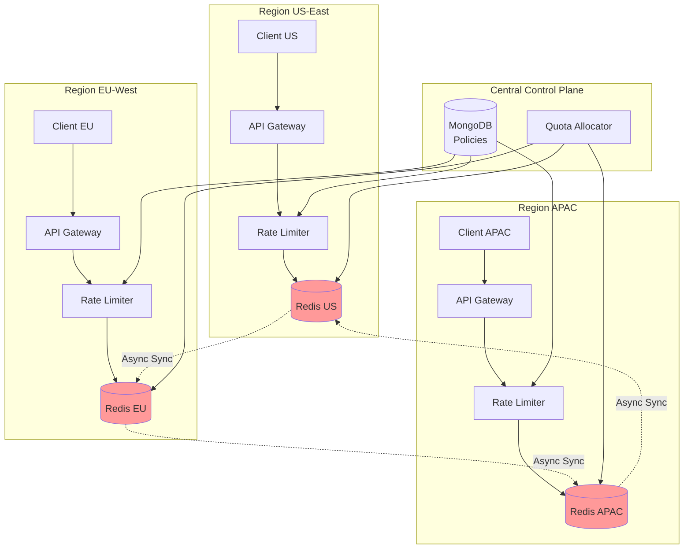
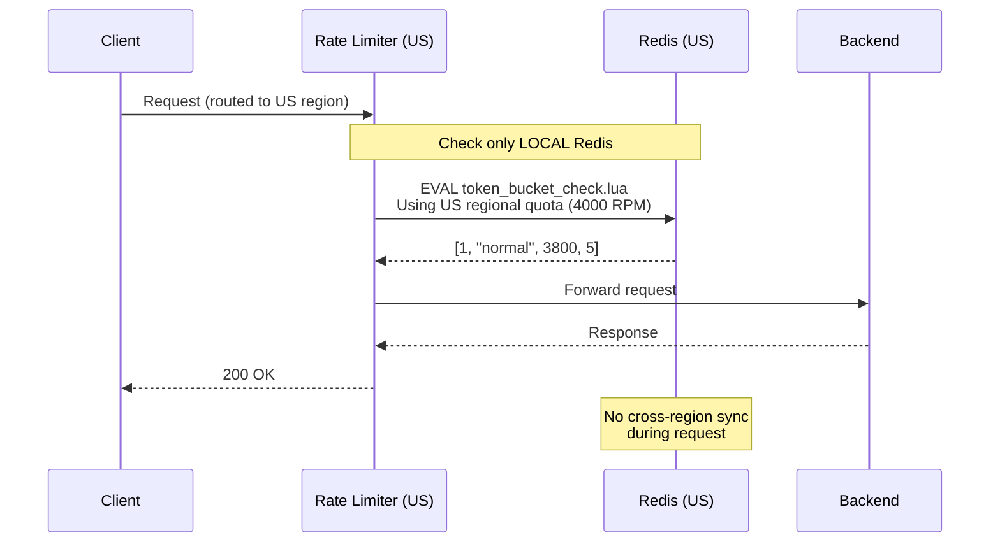
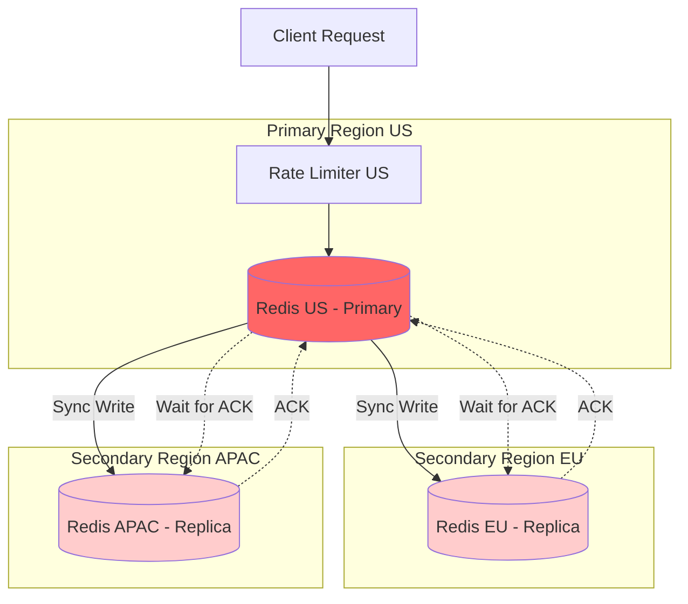

# Multi-Region Architecture (Future Phase)

## Table of Contents
- [Overview](#overview)
- [Eventual Consistency Approach (Recommended)](#eventual-consistency-approach-recommended)
- [Strong Consistency Analysis](#strong-consistency-analysis)
- [Regional Allocation Strategy](#regional-allocation-strategy)
- [Migration Path](#migration-path)

---

## Overview

### Current State (Phase 1)
- **Single region** deployment
- **Exact consistency** within region using Redis Lua scripts
- All rate limit checks hit single Redis cluster
- Latency: 1-5ms for in-region requests

### Future State (Phase 2+)
- **Multi-region** deployment across 3+ geographic regions
- **Regional Redis clusters** in each region
- Choice of consistency model:
  - **Eventual consistency** (recommended): Fast, available, ~98% accurate
  - **Strong consistency** (optional): Slow, accurate, lower availability

---

## Eventual Consistency Approach (Recommended)

### Architecture Overview



### Core Principle: Regional Independence

**Each region operates independently:**
- Client requests route to nearest region
- Rate limit checks only hit local Redis
- No cross-region synchronization during request path
- Background processes reconcile quotas

**Trade-off:**
- ✅ **Low latency**: 5-10ms (same as single region)
- ✅ **High availability**: Region failure doesn't affect others
- ⚠️ **Approximate limits**: Tenant might use 102-105% of global quota temporarily

---

### Strategy 1: Regional Quota Allocation

**Concept:** Pre-allocate portion of global quota to each region.

#### Example Configuration

```typescript
interface MultiRegionPolicy {
  tenant_id: string;
  global_quota: {
    rpm: 10000,
    burst_capacity: 15000
  };
  regional_allocation: {
    'us-east-1': {
      rpm: 4000,          // 40% to US
      burst_capacity: 6000
    },
    'eu-west-1': {
      rpm: 3000,          // 30% to EU
      burst_capacity: 4500
    },
    'ap-southeast-1': {
      rpm: 3000,          // 30% to APAC
      burst_capacity: 4500
    }
  };
}
```

#### Allocation Logic

```typescript
class QuotaAllocator {
  async allocateQuotas(tenantId: string): Promise<void> {
    const policy = await getPolicy(tenantId);
    const regions = ['us-east-1', 'eu-west-1', 'ap-southeast-1'];
    
    // Option 1: Static allocation based on historical traffic
    const allocation = {
      'us-east-1': policy.rpm * 0.40,
      'eu-west-1': policy.rpm * 0.30,
      'ap-southeast-1': policy.rpm * 0.30
    };
    
    // Option 2: Dynamic allocation based on recent usage
    const usage = await getRecentUsageByRegion(tenantId);
    const total = Object.values(usage).reduce((a, b) => a + b, 0);
    
    regions.forEach(region => {
      allocation[region] = policy.rpm * (usage[region] / total);
    });
    
    // Write to each regional Redis
    await Promise.all(regions.map(region => {
      return updateRegionalQuota(region, tenantId, allocation[region]);
    }));
  }
}
```

#### Request Flow



**Characteristics:**
- ✅ Each request only hits local Redis (low latency)
- ✅ No cross-region dependency during request
- ⚠️ If US gets 4500 requests (over 4000 allocation), regional limit enforced
- ⚠️ If EU only uses 1000 (under 3000 allocation), unused quota wasted

---

### Strategy 2: Lazy Synchronization with Conflict-Free Replicated Data Types (CRDTs)

**Concept:** Each region tracks usage independently, syncs in background.

#### Implementation Approach

```typescript
interface RegionalTokenState {
  region: string;
  tokens: number;
  last_sync_ms: number;
  pending_consumption: number;  // Not yet synced to other regions
}

// Background sync every 5 seconds
setInterval(async () => {
  const regions = ['us-east-1', 'eu-west-1', 'ap-southeast-1'];
  
  for (const tenantId of activeTenants) {
    // Gather consumption from all regions
    const regionalConsumption = await Promise.all(
      regions.map(r => getRegionalConsumption(r, tenantId))
    );
    
    // Calculate global consumption
    const totalConsumed = regionalConsumption.reduce((a, b) => a + b, 0);
    
    // Distribute updated state to all regions
    await Promise.all(regions.map(region => {
      return updateRegionalView(region, tenantId, totalConsumed);
    }));
  }
}, 5000);
```

#### Eventual Convergence

```
Time 0s (US):   tokens = 10000
Time 0s (EU):   tokens = 10000
Time 0s (APAC): tokens = 10000

Time 1s:
  US:   100 requests → tokens = 9900
  EU:   50 requests → tokens = 9950
  APAC: 30 requests → tokens = 9970
  (regions don't know about each other's usage yet)

Time 5s (sync):
  Total consumed = 180
  All regions update:
    US:   tokens = 9820
    EU:   tokens = 9820
    APAC: tokens = 9820

Time 6s:
  US:   50 requests → tokens = 9770
  (continues...)
```

**Characteristics:**
- ✅ Simple to implement
- ✅ Low latency (local checks only)
- ⚠️ 5-10 second staleness
- ⚠️ Potential for 3x over-consumption in worst case (all regions use full quota simultaneously)

---

### Strategy 3: Adaptive Regional Limits with Spillover

**Concept:** Allow regions to borrow from global pool when local quota exhausted.

```typescript
async function checkRateLimitWithSpillover(
  tenantId: string,
  region: string
): Promise<RateLimitResult> {
  // Step 1: Check regional quota
  const regionalResult = await checkRegionalBucket(tenantId, region);
  
  if (regionalResult.allowed) {
    return regionalResult;
  }
  
  // Step 2: Regional quota exhausted, try global pool
  const globalResult = await checkGlobalBucket(tenantId);
  
  if (globalResult.allowed) {
    // Log spillover for rebalancing
    await recordSpillover(tenantId, region);
    return { ...globalResult, spillover: true };
  }
  
  return { allowed: false, reason: 'global_quota_exhausted' };
}

// Background rebalancing
setInterval(async () => {
  const spilloverStats = await getSpilloverStats();
  
  for (const [tenantId, stats] of Object.entries(spilloverStats)) {
    if (stats.us_spillover_rate > 0.1) {
      // US region consistently needs more quota
      await increaseRegionalAllocation(tenantId, 'us-east-1', 0.05);
      await decreaseRegionalAllocation(tenantId, 'eu-west-1', 0.05);
    }
  }
}, 3600000);  // Rebalance hourly
```

**Characteristics:**
- ✅ Efficient quota utilization (no waste)
- ✅ Adapts to traffic shifts
- ⚠️ Spillover requires cross-region call (adds latency)
- ⚠️ More complex to implement

---

## Strong Consistency Analysis

### Architecture with Synchronous Replication



### Latency Breakdown

```
Client (Tokyo) → API Gateway (Tokyo): 5ms
API Gateway → Rate Limiter (Tokyo): 1ms
Rate Limiter → Redis (Tokyo): 2ms
  ↓
Redis (Tokyo) → Redis (US): 150ms (trans-Pacific)
Redis (Tokyo) → Redis (EU): 200ms (via US)
  ↓
Wait for ACKs from both regions: 200ms
  ↓
Redis → Rate Limiter: 2ms
Rate Limiter → Backend: 5ms
Backend → Response: 20ms

Total: 385ms (vs 35ms for eventual consistency)
```

### Implementation

```typescript
class StrongConsistencyRateLimiter {
  async checkRateLimit(
    tenantId: string,
    region: string
  ): Promise<RateLimitResult> {
    const primaryRedis = getRegionalRedis('us-east-1');  // Always primary
    const replicaRedises = [
      getRegionalRedis('eu-west-1'),
      getRegionalRedis('ap-southeast-1')
    ];
    
    // Step 1: Execute on primary
    const result = await primaryRedis.eval(TOKEN_BUCKET_LUA, ...);
    
    // Step 2: Synchronously replicate to all replicas
    await Promise.all(replicaRedises.map(redis => 
      redis.hset(bucketKey, 'tokens', result.tokens)
    ));
    
    // Step 3: Wait for acknowledgment from all replicas
    const acks = await Promise.all(replicaRedises.map(redis =>
      redis.get(`ack:${bucketKey}`)
    ));
    
    if (acks.every(ack => ack === 'OK')) {
      return result;
    } else {
      throw new Error('Replication failed');
    }
  }
}
```

### Trade-off Analysis

| Aspect | Eventual Consistency | Strong Consistency |
|--------|---------------------|-------------------|
| **Latency (same region)** | 5-10ms | 5-10ms |
| **Latency (cross-region)** | 5-10ms | 200-400ms |
| **Accuracy** | ~98% (may allow 102-105% of quota) | 100% exact |
| **Availability** | 99.99% (region failures isolated) | 99.5% (primary failure affects all) |
| **Complexity** | Low | High |
| **Cost** | Low (regional traffic only) | High (cross-region data transfer) |

### When to Use Strong Consistency

**Use Cases:**
- ❌ **General SaaS rate limiting** - Overkill, eventual consistency sufficient
- ❌ **Public APIs** - Latency impact too high
- ✅ **Financial transaction limits** - Accuracy critical (prevent overdraft)
- ✅ **Regulatory compliance** - Exact limits required by law
- ✅ **Low-traffic, high-value operations** - 200ms acceptable

**Example: Financial Trading API**
```json
{
  "tenant_id": "trading_firm_123",
  "policies": {
    "tenant": {
      "daily_trade_limit": 10000,
      "consistency": "strong"  // Prevent exceeding regulatory limit
    }
  }
}
```

**Recommendation for General Use:**  
🎯 **Use eventual consistency** - The 2-5% over-limit is acceptable trade-off for 40x faster response times and better availability.

---

## Regional Allocation Strategy

### Traffic Pattern Analysis

Before deploying multi-region, analyze historical traffic distribution:

```sql
-- Example query on existing logs
SELECT 
  client_region,
  tenant_id,
  COUNT(*) as request_count,
  COUNT(*) / SUM(COUNT(*)) OVER (PARTITION BY tenant_id) as pct
FROM request_logs
WHERE timestamp > NOW() - INTERVAL '30 days'
GROUP BY client_region, tenant_id
ORDER BY tenant_id, pct DESC;
```

**Result:**
```
tenant_id       | client_region | request_count | pct
----------------|---------------|---------------|-----
acme_corp       | us-east-1     | 450000        | 45%
acme_corp       | eu-west-1     | 350000        | 35%
acme_corp       | ap-southeast  | 200000        | 20%
```

### Dynamic Allocation Algorithm

```typescript
class DynamicQuotaAllocator {
  async rebalanceQuotas(tenantId: string): Promise<void> {
    // Get last 24 hours of usage per region
    const usage = await getUsageByRegion(tenantId, '24h');
    const totalUsage = Object.values(usage).reduce((a, b) => a + b, 0);
    
    // Get tenant's global quota
    const policy = await getPolicy(tenantId);
    const globalQuota = policy.tenant.rpm;
    
    // Calculate allocation percentages
    const allocations: Record<string, number> = {};
    
    for (const [region, regionUsage] of Object.entries(usage)) {
      // Base allocation on usage percentage
      let pct = regionUsage / totalUsage;
      
      // Add 10% buffer for traffic spikes
      pct = pct * 1.1;
      
      // Ensure minimum 5% per region
      pct = Math.max(pct, 0.05);
      
      allocations[region] = globalQuota * pct;
    }
    
    // Normalize to 100%
    const sum = Object.values(allocations).reduce((a, b) => a + b, 0);
    for (const region in allocations) {
      allocations[region] = (allocations[region] / sum) * globalQuota;
    }
    
    // Apply new allocations
    await updateRegionalQuotas(tenantId, allocations);
  }
}
```

---

## Migration Path

### Phase 1: Single Region (Current)

```
[Client] → [API Gateway] → [Rate Limiter] → [Redis] → [Backend]
```

**Characteristics:**
- Simple architecture
- Exact consistency
- 5ms latency

---

### Phase 2: Multi-Region Preparation

**Changes:**
1. Add `region` field to all rate limit keys
2. Update Lua scripts to check regional quotas
3. Deploy regional Redis clusters
4. Route traffic to nearest region

**No breaking changes** - still exact consistency within each region

```typescript
// Updated key format
const key = `ratelimit:${region}:tenant:${tenantId}:bucket`;
```

---

### Phase 3: Regional Allocation Deployment

**Changes:**
1. Implement QuotaAllocator service
2. Pre-allocate regional quotas based on traffic analysis
3. Monitor for spillover events
4. Tune allocations

**Migration:**
```typescript
// Week 1: Shadow mode - calculate allocations but don't enforce
if (SHADOW_MODE) {
  const wouldBeThrottled = checkRegionalLimit();
  log({ wouldBeThrottled, actualLimit: checkGlobalLimit() });
}

// Week 2: Enforce regional limits with generous buffer
const regionalLimit = globalLimit * 1.5;  // 50% buffer

// Week 3: Tighten to target allocation
const regionalLimit = globalLimit * 1.1;  // 10% buffer

// Week 4: Final allocation
const regionalLimit = calculateOptimalAllocation();
```

---

### Phase 4: Background Synchronization

**Changes:**
1. Implement sync service that aggregates regional usage
2. Update regional views every 5-10 seconds
3. Monitor for drift between regions

**Monitoring:**
```typescript
// Alert if regional views drift >10%
const usRegionView = await redis_us.get(`tenant:${id}:tokens`);
const euRegionView = await redis_eu.get(`tenant:${id}:tokens`);
const drift = Math.abs(usRegionView - euRegionView) / usRegionView;

if (drift > 0.10) {
  alert('Regional token drift exceeded 10%');
}
```

---

### Rollback Plan

**If multi-region causes issues:**

```typescript
// Emergency rollback to single region
if (EMERGENCY_ROLLBACK) {
  // Route all traffic to primary region
  const PRIMARY_REGION = 'us-east-1';
  
  // Disable regional quota checks
  const checkResult = await checkGlobalQuota(tenantId);  // Ignores region
  
  // Stop background sync
  clearInterval(syncInterval);
}
```

---

## Summary Recommendation

For **Phase 2** (Multi-Region):

✅ **Use Eventual Consistency with Regional Allocation**

**Rationale:**
- 5-10ms latency (same as single region)
- 99.99% availability (regions isolated)
- 98-99% accuracy (acceptable for rate limiting)
- Simple to implement and operate
- Scales to any number of regions

**Avoid Strong Consistency** unless specific compliance requirement (financial, regulatory).

---

**Document Version:** 1.0  
**Last Updated:** 2026-02-14
