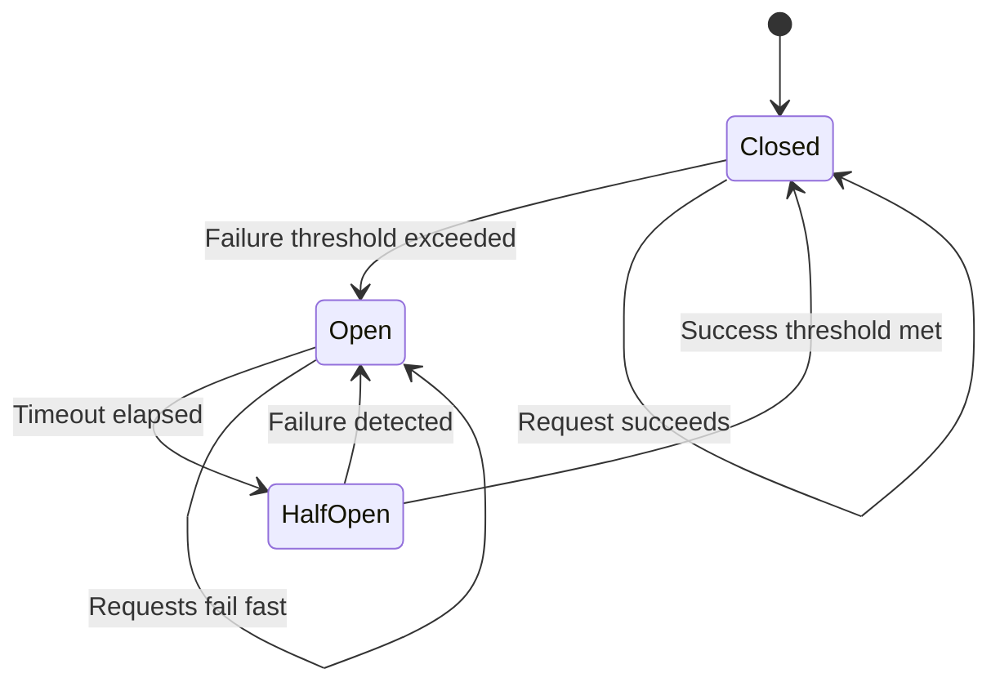

# Failure Handling & Resilience

## Table of Contents
- [Failure Modes](#failure-modes)
- [Fail-Open Strategy](#fail-open-strategy)
- [Fallback Rate Limits](#fallback-rate-limits)
- [Circuit Breaker Pattern](#circuit-breaker-pattern)
- [Recovery Procedures](#recovery-procedures)

---

## Failure Modes

### FM-1: Redis Timeout

**Symptom:** Redis commands exceed 100ms threshold

**Causes:**
- Network congestion between rate limiter and Redis
- Redis under heavy load (CPU saturation)
- Slow queries or large keys
- Connection pool exhaustion

**Impact:**
- Request latency spike (100ms+ added)
- Potential cascade failure if timeouts pile up

---

### FM-2: Redis Unavailable

**Symptom:** Cannot establish connection to Redis

**Causes:**
- Redis cluster down (maintenance, crash, OOM)
- Network partition between rate limiter and Redis
- DNS resolution failure
- All connection pool connections exhausted

**Impact:**
- Complete inability to check rate limits
- System must fail-open or fail-closed

---

### FM-3: MongoDB Unavailable

**Symptom:** Cannot fetch rate limit policies

**Causes:**
- MongoDB cluster down
- Network partition
- Query timeout

**Impact:**
- Cannot load new policies
- Existing cached policies continue to work
- New tenants cannot be rate limited

---

### FM-4: Policy Cache Stale

**Symptom:** Rate limiter using outdated policy configuration

**Causes:**
- Background refresh failing
- MongoDB replication lag
- Cache not invalidated after policy update

**Impact:**
- Tenants limited with old quotas (could be too strict or too lenient)
- Inconsistent limits across rate limiter instances

---

## Fail-Open Strategy

### Decision Matrix

| Failure Type | Strategy | Rationale |
|--------------|----------|-----------|
| Redis timeout (>100ms) | Fail-open with fallback limits | Availability > Accuracy |
| Redis unavailable | Fail-open with fallback limits | Availability > Accuracy |
| MongoDB unavailable | Use cached policies | Policies change infrequently |
| All systems unavailable | Fail-open (no limits) | Keep API functional |

### Fail-Open Implementation

```typescript
class RateLimiter {
  private fallbackActive = false;
  private localCounters = new Map<string, number>();
  
  async checkRateLimit(request: Request): Promise<RateLimitDecision> {
    try {
      // Attempt normal rate limiting with timeout
      const result = await Promise.race([
        this.checkWithRedis(request),
        this.timeout(100)  // 100ms timeout
      ]);
      
      return result;
      
    } catch (error) {
      if (error.message === 'TIMEOUT' || error.code === 'ECONNREFUSED') {
        // Activate fallback mode
        this.activateFallback(error);
        
        // Check using local in-memory counters
        return this.checkWithFallback(request);
      }
      
      throw error;
    }
  }
  
  private activateFallback(error: Error): void {
    if (!this.fallbackActive) {
      this.fallbackActive = true;
      
      // Emit metrics
      prometheus.fallbackActivations.inc({
        reason: error.message === 'TIMEOUT' ? 'redis_timeout' : 'redis_unavailable'
      });
      
      // Log alert
      logger.error('Rate limiter fallback activated', {
        reason: error.message,
        timestamp: Date.now()
      });
    }
  }
  
  private async checkWithFallback(request: Request): Promise<RateLimitDecision> {
    const key = this.getFallbackKey(request);
    const currentCount = this.localCounters.get(key) || 0;
    
    // Apply conservative fallback limits: 100 RPM, 50 burst
    const FALLBACK_RPM = 100;
    const FALLBACK_BURST = 50;
    
    // Simple sliding window counter (last 60 seconds)
    const windowStart = Date.now() - 60000;
    this.cleanupOldCounters(windowStart);
    
    if (currentCount < FALLBACK_BURST) {
      this.localCounters.set(key, currentCount + 1);
      
      return {
        allowed: true,
        state: 'fallback',
        message: 'Using fallback rate limits due to Redis unavailability'
      };
    }
    
    return {
      allowed: false,
      state: 'fallback_throttled',
      message: 'Fallback rate limit exceeded (100 RPM)'
    };
  }
  
  private getFallbackKey(request: Request): string {
    // In fallback mode, limit per tenant or IP
    const tenantId = request.auth?.tenant_id || 'anonymous';
    const ip = request.ip;
    
    return `${tenantId}:${ip}:${Math.floor(Date.now() / 60000)}`;
  }
}
```

---

## Fallback Rate Limits

### Default Fallback Configuration

```typescript
const FALLBACK_CONFIG = {
  // Conservative limits to prevent abuse while maintaining availability
  rpm: 100,
  rps: 2,
  burst_capacity: 50,
  
  // Duration before attempting Redis reconnect
  fallback_duration_ms: 10000,  // 10 seconds
  
  // Retry strategy
  max_retries: 3,
  retry_backoff_ms: 1000  // 1 second
};
```

### Fallback Behavior by Request Type

| Request Type | Fallback Limit | Rationale |
|--------------|----------------|-----------|
| **Authenticated (known tenant)** | 100 RPM | Generous enough for critical workflows |
| **Anonymous (IP-based)** | 50 RPM | More conservative for unauthenticated |
| **Critical endpoints** (e.g., /health) | No limit | Always allow health checks |
| **Admin endpoints** | 10 RPM | Restrict sensitive operations |

```typescript
function getFallbackLimit(request: Request): number {
  if (request.path === '/health' || request.path === '/metrics') {
    return Infinity;  // No limit
  }
  
  if (request.path.startsWith('/admin')) {
    return 10;  // Very conservative
  }
  
  if (request.auth?.tenant_id) {
    return 100;  // Authenticated
  }
  
  return 50;  // Anonymous
}
```

---

## Circuit Breaker Pattern

### Circuit Breaker States



### Implementation

```typescript
enum CircuitState {
  CLOSED = 'closed',      // Normal operation
  OPEN = 'open',          // Failing, reject immediately
  HALF_OPEN = 'half_open' // Testing if recovered
}

class CircuitBreaker {
  private state: CircuitState = CircuitState.CLOSED;
  private failureCount = 0;
  private successCount = 0;
  private lastFailureTime = 0;
  
  private readonly FAILURE_THRESHOLD = 5;      // Open after 5 failures
  private readonly SUCCESS_THRESHOLD = 3;      // Close after 3 successes
  private readonly TIMEOUT_MS = 10000;         // Try recovery after 10s
  
  async execute<T>(operation: () => Promise<T>): Promise<T> {
    if (this.state === CircuitState.OPEN) {
      // Check if timeout elapsed
      if (Date.now() - this.lastFailureTime > this.TIMEOUT_MS) {
        this.state = CircuitState.HALF_OPEN;
        logger.info('Circuit breaker entering HALF_OPEN state');
      } else {
        // Still open, fail fast
        throw new Error('Circuit breaker OPEN - Redis unavailable');
      }
    }
    
    try {
      const result = await operation();
      this.onSuccess();
      return result;
    } catch (error) {
      this.onFailure();
      throw error;
    }
  }
  
  private onSuccess(): void {
    this.failureCount = 0;
    
    if (this.state === CircuitState.HALF_OPEN) {
      this.successCount++;
      
      if (this.successCount >= this.SUCCESS_THRESHOLD) {
        this.state = CircuitState.CLOSED;
        this.successCount = 0;
        logger.info('Circuit breaker CLOSED - Redis recovered');
        
        prometheus.circuitBreakerState.set({ state: 'closed' }, 1);
      }
    }
  }
  
  private onFailure(): void {
    this.failureCount++;
    this.lastFailureTime = Date.now();
    
    if (this.failureCount >= this.FAILURE_THRESHOLD) {
      this.state = CircuitState.OPEN;
      this.successCount = 0;
      logger.error('Circuit breaker OPEN - Redis failing');
      
      prometheus.circuitBreakerState.set({ state: 'open' }, 1);
    }
  }
  
  getState(): CircuitState {
    return this.state;
  }
}

// Usage
const redisCircuitBreaker = new CircuitBreaker();

async function checkWithCircuitBreaker(key: string): Promise<RateLimitResult> {
  try {
    return await redisCircuitBreaker.execute(async () => {
      return await redis.eval(TOKEN_BUCKET_LUA, key, ...);
    });
  } catch (error) {
    // Circuit open or Redis failed
    return applyFallbackLimit();
  }
}
```

### Circuit Breaker Metrics

```typescript
const circuitBreakerMetrics = {
  state: new Gauge({
    name: 'rate_limiter_circuit_breaker_state',
    help: 'Circuit breaker state (0=closed, 1=open, 2=half_open)',
    labelNames: ['resource']
  }),
  
  transitions: new Counter({
    name: 'rate_limiter_circuit_breaker_transitions_total',
    help: 'Circuit breaker state transitions',
    labelNames: ['from', 'to']
  }),
  
  rejections: new Counter({
    name: 'rate_limiter_circuit_breaker_rejections_total',
    help: 'Requests rejected by circuit breaker'
  })
};
```

---

## Recovery Procedures

### Automatic Recovery

```typescript
class RecoveryManager {
  private checkInterval: NodeJS.Timeout | null = null;
  
  startRecoveryMonitoring(): void {
    // Check Redis health every 5 seconds during fallback
    this.checkInterval = setInterval(async () => {
      if (rateLimiter.fallbackActive) {
        const healthy = await this.checkRedisHealth();
        
        if (healthy) {
          await this.recoverFromFallback();
        }
      }
    }, 5000);
  }
  
  private async checkRedisHealth(): Promise<boolean> {
    try {
      // Simple ping with timeout
      const result = await Promise.race([
        redis.ping(),
        this.timeout(100)
      ]);
      
      return result === 'PONG';
    } catch {
      return false;
    }
  }
  
  private async recoverFromFallback(): Promise<void> {
    logger.info('Redis recovered, exiting fallback mode');
    
    // Clear local counters
    rateLimiter.localCounters.clear();
    
    // Deactivate fallback
    rateLimiter.fallbackActive = false;
    
    // Emit recovery metric
    prometheus.fallbackRecoveries.inc();
    
    // Resume normal operation
    logger.info('Rate limiter back to normal operation');
  }
}
```

---

### Manual Recovery (Runbook)

#### Scenario 1: Redis Down

**Detection:**
```bash
# Check Grafana dashboard
# Alert: "rate_limiter_fallback_activations_total" spiking

# Verify Redis status
kubectl get pods -n redis
redis-cli -h redis-cluster ping
```

**Resolution:**
```bash
# Option 1: Restart Redis pods
kubectl rollout restart deployment/redis -n redis

# Option 2: Scale up Redis
kubectl scale deployment/redis --replicas=5 -n redis

# Option 3: Emergency bypass (temporary)
# Set environment variable to disable rate limiting
kubectl set env deployment/rate-limiter RATE_LIMIT_ENABLED=false
```

**Verification:**
```bash
# Check fallback metric decreasing
curl http://rate-limiter:9090/metrics | grep fallback_activations

# Check circuit breaker closed
curl http://rate-limiter:9090/metrics | grep circuit_breaker_state
```

---

#### Scenario 2: MongoDB Policy Fetch Failing

**Detection:**
```bash
# Check logs for MongoDB errors
kubectl logs -f deployment/rate-limiter | grep "MongoDB connection"

# Check cached policy count
curl http://rate-limiter:9090/metrics | grep policy_cache_size
```

**Resolution:**
```bash
# Rate limiter continues with cached policies
# No immediate action needed if cache is warm

# Fix MongoDB connection
kubectl rollout restart statefulset/mongodb -n database

# Verify policy fetch working
curl http://rate-limiter:9090/health/dependencies
```

**Impact:**
- Existing tenants: No impact (cached policies active)
- New tenants: Cannot onboard until MongoDB recovered

---

#### Scenario 3: Cache Stale (Incorrect Limits Applied)

**Detection:**
```bash
# User report: "I'm being throttled but I upgraded"
# Check policy last updated vs cache
db.rate_limit_policies.findOne({ tenant_id: "acme" })

# Check rate limiter cache age
curl http://rate-limiter:9090/debug/cache/acme
```

**Resolution:**
```bash
# Option 1: Force cache invalidation
curl -X POST http://rate-limiter:9090/admin/cache/invalidate \
  -d '{"tenant_id": "acme"}'

# Option 2: Restart rate limiter instances (rolling)
kubectl rollout restart deployment/rate-limiter

# Option 3: Reduce cache TTL (if systemic issue)
kubectl set env deployment/rate-limiter POLICY_CACHE_TTL=30000
```

---

## Graceful Degradation Levels

### Level 0: Normal Operation
- All systems healthy
- Redis latency <5ms
- MongoDB available
- Policies up-to-date

### Level 1: Minor Degradation (Warning)
- Redis latency 5-50ms
- Policy cache using TTL-based refresh (no MongoDB)
- **Impact:** Slightly higher response times, no functional change

### Level 2: Moderate Degradation (Fallback)
- Redis timeout >50ms or unavailable
- Using local in-memory counters
- Fallback limits: 100 RPM
- **Impact:** Less accurate rate limiting, some over/under limiting

### Level 3: Severe Degradation (Bypass)
- All dependencies unavailable
- Rate limiting fully disabled
- **Impact:** No protection from abuse, rely on upstream WAF

```typescript
function getDegradationLevel(): number {
  if (!redisHealthy && !mongoHealthy) {
    return 3;  // Severe - bypass rate limiting
  }
  
  if (!redisHealthy) {
    return 2;  // Moderate - fallback mode
  }
  
  if (redisLatency > 50) {
    return 1;  // Minor - warning
  }
  
  return 0;  // Normal
}
```

---

## Monitoring & Alerts

### Key Metrics to Track

```typescript
const failureMetrics = {
  // Fallback activations
  fallbackActivations: new Counter({
    name: 'rate_limiter_fallback_activations_total',
    help: 'Number of times fallback mode activated',
    labelNames: ['reason']
  }),
  
  // Requests handled in fallback
  fallbackRequests: new Counter({
    name: 'rate_limiter_fallback_requests_total',
    help: 'Requests processed in fallback mode',
    labelNames: ['result']
  }),
  
  // Redis health
  redisHealthy: new Gauge({
    name: 'rate_limiter_redis_healthy',
    help: 'Redis health status (1=healthy, 0=unhealthy)'
  }),
  
  // Redis latency
  redisLatency: new Histogram({
    name: 'rate_limiter_redis_latency_ms',
    help: 'Redis operation latency',
    buckets: [1, 5, 10, 25, 50, 100, 250, 500]
  })
};
```

### Dashboard Example (PromQL)

```promql
# Fallback activation rate (per minute)
rate(rate_limiter_fallback_activations_total[1m])

# Percentage of requests in fallback mode
rate(rate_limiter_fallback_requests_total[5m]) 
  / 
rate(rate_limiter_requests_total[5m]) * 100

# Redis latency P99
histogram_quantile(0.99, rate(rate_limiter_redis_latency_ms_bucket[5m]))

# Circuit breaker state (0=closed, 1=open, 2=half_open)
rate_limiter_circuit_breaker_state
```

---

## Summary: Failure Handling Strategy

| Failure | Detection | Response | Recovery | Impact |
|---------|-----------|----------|----------|--------|
| **Redis timeout** | Latency >100ms | Fail-open, fallback limits | Auto-retry every 5s | Minor (conservative limits) |
| **Redis down** | Connection refused | Fail-open, fallback limits | Circuit breaker, auto-recovery | Moderate (local counters) |
| **MongoDB down** | Connection error | Use cached policies | Manual restart | Low (cache continues) |
| **All systems down** | Health check failures | Disable rate limiting | Manual intervention | High (no protection) |

**Core Principle:** **Availability > Accuracy** for rate limiting. Better to allow some extra requests than to reject legitimate traffic.

---

**Document Version:** 1.0  
**Last Updated:** 2026-02-14
