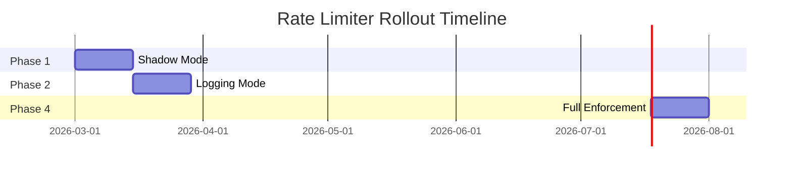

# Rollout Plan & Operations

## Table of Contents
- [Rollout Phases](#rollout-phases)
- [Metrics by Phase](#metrics-by-phase)
- [Tuning Guidelines](#tuning-guidelines)
- [Operational Procedures](#operational-procedures)

---

## Rollout Phases

### Overview

The rate limiter will be rolled out in **4 phases** over **8 weeks**:



---

### Phase 1: Shadow Mode (Weeks 1-2)

**Goal:** Validate rate limiting logic without affecting traffic

**Behavior:**
- ✅ Rate limiter checks all requests
- ✅ Calculates throttle state (normal/soft/hard)
- ❌ **Does NOT block any requests**
- ✅ Logs would-be throttled requests
- ✅ Emits metrics with `mode="shadow"` label

```typescript
async function checkRateLimitShadowMode(request: Request): Promise<void> {
  const decision = await rateLimiter.check(request);
  
  // Log the decision but don't enforce
  logger.info('Shadow mode decision', {
    tenant_id: request.tenant_id,
    endpoint: request.path,
    decision: decision.allowed ? 'allow' : 'throttle',
    state: decision.state,
    mode: 'shadow'
  });
  
  // Emit metrics
  prometheus.requests.inc({
    result: decision.allowed ? 'allowed' : 'throttled',
    state: decision.state,
    mode: 'shadow'
  });
  
  // ALWAYS allow request through
  return;  // Continue to backend
}
```

**Success Criteria:**
- [ ] 0 errors in rate limiter service logs
- [ ] Redis latency P99 <10ms
- [ ] Shadow throttle rate <5% of total requests
- [ ] No false positives (legitimate traffic flagged as abuse)

**Metrics to Monitor:**

```promql
# Shadow throttle rate
rate(rate_limiter_requests_total{result="throttled",mode="shadow"}[5m])
  /
rate(rate_limiter_requests_total{mode="shadow"}[5m]) * 100

# Would-be throttled requests by tenant
topk(10, 
  rate(rate_limiter_requests_total{result="throttled",mode="shadow"}[1h])
)

# Would-be throttled requests by endpoint
sum by (endpoint) (
  rate(rate_limiter_requests_total{result="throttled",mode="shadow"}[1h])
)
```

**Go/No-Go Decision:**
- ✅ GO if shadow throttle rate <5% and no errors
- ❌ NO-GO if >5% throttled (policies too strict) or high error rate

---

### Phase 2: Logging Mode (Weeks 3-4)

**Goal:** Return rate limit headers to clients, but still allow all requests

**Behavior:**
- ✅ Calculate throttle state
- ✅ Return rate limit headers to clients
- ❌ **Does NOT reject requests (even if over limit)**
- ✅ Logs + metrics with `mode="logging"`

```typescript
async function checkRateLimitLoggingMode(request: Request): Promise<Response> {
  const decision = await rateLimiter.check(request);
  
  // Add rate limit headers to response
  const headers = {
    'X-RateLimit-Limit': decision.limit.toString(),
    'X-RateLimit-Remaining': decision.remaining.toString(),
    'X-RateLimit-Reset': decision.reset.toString()
  };
  
  if (decision.state === 'soft' || decision.state === 'hard') {
    headers['X-RateLimit-Warning'] = 'true';
    headers['X-RateLimit-Retry-After'] = '30';
  }
  
  // Log decision
  logger.info('Logging mode decision', {
    decision: decision.allowed ? 'allow' : 'would_throttle',
    state: decision.state,
    mode: 'logging'
  });
  
  // Emit metrics
  prometheus.requests.inc({
    result: decision.allowed ? 'allowed' : 'throttled',
    state: decision.state,
    mode: 'logging'
  });
  
  // ALWAYS forward to backend
  return forwardWithHeaders(request, headers);
}
```

**Success Criteria:**
- [ ] Clients receive accurate rate limit headers
- [ ] <1% of clients violate limits after seeing warning headers
- [ ] Support tickets about rate limits <5/week
- [ ] API partners acknowledge receipt of headers

**Client Communication:**

```markdown
**Email to API Partners (Week 3):**

Subject: Rate Limiting Headers Now Active

Hi [Partner],

We've started returning rate limit headers on all API responses:

- `X-RateLimit-Limit`: Your max requests per minute
- `X-RateLimit-Remaining`: Requests left in current window
- `X-RateLimit-Reset`: Unix timestamp when limit resets
- `X-RateLimit-Warning`: true if you're approaching limit

Please update your integration to:
1. Read these headers
2. Implement exponential backoff if `Remaining` is low
3. Respect `Retry-After` if you see a warning

Rate limiting enforcement starts in 2 weeks.

Thanks,
Platform Team
```

**Go/No-Go Decision:**
- ✅ GO if clients implement header handling and violations decrease
- ❌ NO-GO if clients don't respond or violations stay high

---

### Phase 3: Full Enforcement (Weeks 5-8)

**Goal:** Enforce configured limits exactly

**Behavior:**
- ✅ Normal state: 0-100% of limit
- ✅ Soft throttle: 100-105% (warning headers)
- ✅ Hard throttle: >105% (reject with 429)
- ✅ Metrics with `mode="enforcement"`

```typescript
async function checkRateLimitFullEnforcement(request: Request): Promise<Response> {
  const decision = await rateLimiter.check(request);
  
  if (!decision.allowed) {
    // Hard throttle
    prometheus.requests.inc({
      result: 'throttled',
      state: decision.state,
      mode: 'enforcement'
    });
    
    return {
      status: 429,
      headers: rateLimitHeaders(decision),
      body: {
        error: 'Rate limit exceeded',
        limit: decision.limit,
        retry_after: decision.retry_after
      }
    };
  }
  
  if (decision.state === 'soft') {
    // Soft throttle (allow but warn)
    prometheus.requests.inc({
      result: 'allowed',
      state: 'soft',
      mode: 'enforcement'
    });
    
    return forwardWithWarningHeaders(request, decision);
  }
  
  // Normal state
  prometheus.requests.inc({
    result: 'allowed',
    state: 'normal',
    mode: 'enforcement'
  });
  
  return forwardWithHeaders(request, rateLimitHeaders(decision));
}
```

**Success Criteria:**
- [ ] Throttle rate stable at <1% of requests
- [ ] Support tickets <5/week
- [ ] No reports of legitimate traffic being blocked
- [ ] API uptime maintained at 99.9%

**Ongoing Monitoring:**

```promql
# Weekly throttle rate trend
rate(rate_limiter_requests_total{result="throttled",mode="enforcement"}[7d])

# Tenants frequently hitting limits (may need upgrades)
topk(10, 
  sum_over_time(rate_limiter_requests_total{result="throttled",mode="enforcement"}[30d])
)

# Soft throttle effectiveness (are warnings helping?)
rate(rate_limiter_requests_total{state="soft",mode="enforcement"}[1h])
  /
rate(rate_limiter_requests_total{result="throttled",mode="enforcement"}[1h])
```

---

## Metrics by Phase

### Comprehensive Metric Structure

```typescript
// All metrics include mode label for phase comparison
const metrics = {
  requests: new Counter({
    name: 'rate_limiter_requests_total',
    help: 'Total rate limit checks',
    labelNames: [
      'tenant_id',
      'user_id',
      'endpoint',
      'result',      // "allowed" | "throttled"
      'state',       // "normal" | "soft" | "hard" | "fallback"
      'mode',        // "shadow" | "logging" | "enforcement"
      'scope'        // "user" | "tenant" | "endpoint" | "global"
    ]
  }),
  
  latency: new Histogram({
    name: 'rate_limiter_check_duration_ms',
    help: 'Rate limit check latency in milliseconds',
    labelNames: ['scope', 'mode'],
    buckets: [1, 2, 5, 10, 20, 50, 100]
  }),
  
  tokens: new Gauge({
    name: 'rate_limiter_bucket_tokens',
    help: 'Current tokens in bucket',
    labelNames: ['scope', 'tenant_id', 'endpoint', 'mode']
  }),
  
  policyCache: new Gauge({
    name: 'rate_limiter_policy_cache_size',
    help: 'Number of policies in cache',
    labelNames: ['mode']
  }),
  
  policyCacheHits: new Counter({
    name: 'rate_limiter_policy_cache_hits_total',
    help: 'Policy cache hit count',
    labelNames: ['mode']
  }),
  
  fallbacks: new Counter({
    name: 'rate_limiter_fallback_activations_total',
    help: 'Fallback mode activations',
    labelNames: ['reason', 'mode']
  })
};
```

---

## Tuning Guidelines

### When to Adjust Limits

#### Scenario 1: Tenant Consistently Hitting Limit

**Detection:**
```promql
# Tenant hitting limit >5% of requests
rate(rate_limiter_requests_total{
  tenant_id="acme_corp",
  result="throttled"
}[7d])
  /
rate(rate_limiter_requests_total{
  tenant_id="acme_corp"
}[7d]) > 0.05
```

**Action:**
```typescript
// Increase limit by 50%
await db.rate_limit_policies.updateOne(
  { tenant_id: 'acme_corp' },
  { 
    $set: { 
      'policies.tenant.rpm': currentRPM * 1.5,
      'policies.tenant.burst_capacity': currentBurst * 1.5
    } 
  }
);

// Or upgrade tier
await upgradeTenant('acme_corp', 'pro' → 'enterprise');
```

---

#### Scenario 2: Endpoint Receiving Unexpected Traffic

**Detection:**
```promql
# Endpoint traffic 3x higher than baseline
rate(rate_limiter_requests_total{
  endpoint="/api/new-feature"
}[1h])
  /
avg_over_time(rate(rate_limiter_requests_total{
  endpoint="/api/new-feature"
}[7d])[1h:]) > 3
```

**Action:**
```typescript
// Temporarily increase endpoint limit
await db.global_policies.updateOne(
  { _id: 'global_config' },
  {
    $set: {
      'policies.endpoints./api/new-feature': {
        rpm: 10000,  // Increased from 5000
        burst_capacity: 15000
      }
    }
  }
);
```

---

#### Scenario 3: Global System Capacity Reached

**Detection:**
```promql
# Global bucket at >90% usage
rate_limiter_bucket_tokens{scope="global"} 
  / 
rate_limiter_bucket_capacity{scope="global"} < 0.10
```

**Action:**
```typescript
// Option 1: Scale infrastructure
await kubernetes.scale('backend-service', { replicas: 10 → 15 });

// Option 2: Increase global limit
await db.global_policies.updateOne(
  { _id: 'global_config' },
  { $set: { 'policies.global.rpm': 150000 } }  // Was 100000
);

// Option 3: Temporarily reduce tenant limits
await db.rate_limit_policies.updateMany(
  { tier: 'free' },
  { $mul: { 'policies.tenant.rpm': 0.8 } }  // 20% reduction
);
```

---

### Tuning Soft/Hard Thresholds

```typescript
// More lenient (e.g., enterprise tier)
{
  throttle_config: {
    soft_threshold_pct: 100,
    hard_threshold_pct: 120  // Allow 20% overage
  }
}

// More strict (e.g., free tier)
{
  throttle_config: {
    soft_threshold_pct: 90,   // Warn at 90%
    hard_threshold_pct: 100   // Block at 100%
  }
}

// Very conservative (e.g., abuse-prone endpoint)
{
  throttle_config: {
    soft_threshold_pct: 80,
    hard_threshold_pct: 90
  }
}
```

---

## Summary Checklist

### Pre-Deployment
- [ ] Redis cluster deployed and tested
- [ ] MongoDB policies collection created
- [ ] Rate limiter service deployed
- [ ] Prometheus metrics configured
- [ ] Grafana dashboards created

### Phase 1: Shadow Mode
- [ ] Shadow mode enabled
- [ ] Metrics showing expected throttle rate
- [ ] No errors in logs
- [ ] Redis performance acceptable

### Phase 2: Logging Mode
- [ ] Rate limit headers returned
- [ ] Clients acknowledge receipt
- [ ] Documentation updated
- [ ] Support team trained

### Phase 3: Full Enforcement
- [ ] Normal/soft/hard throttling active
- [ ] Throttle rate stable <1%
- [ ] Support tickets minimal
- [ ] Monitoring operational

### Post-Rollout
- [ ] Weekly tuning reviews scheduled
- [ ] Runbooks documented
- [ ] Success metrics tracked

---

**Document Version:** 1.0  
**Last Updated:** 2026-02-14
